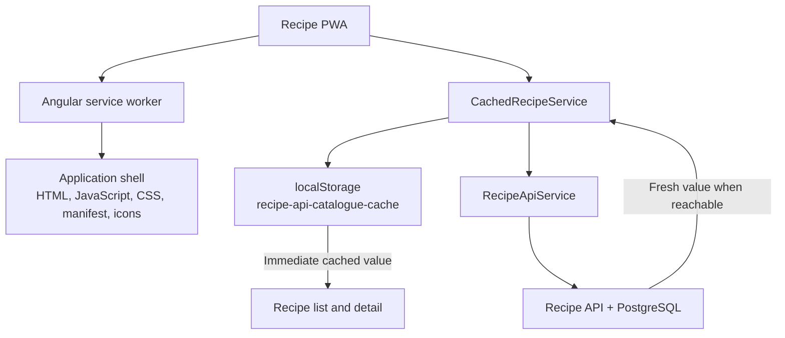

# Recipe offline mode

The Recipe application supports **cached, read-only browsing** when the API is
unreachable. After a successful online visit, users can reopen the production
PWA and read the cached recipe catalogue and recipe details.

This is deliberately not a full offline-sync system. The API remains the
source of truth, and offline writes are neither stored nor replayed later.

## Architecture

Offline support is split into two independent cache layers:



The Angular service worker makes the application itself loadable offline.
`CachedRecipeService` is responsible for recipe data. API responses are
not cached by the service worker.

## Production composition

Features depend on the abstract `RecipeService`. Its contract also exposes a
`readStatus` signal:

| Mode | Meaning |
| --- | --- |
| `checking` | An API read is in progress. |
| `live` | The latest API read succeeded. |
| `cached` | The API request failed, but a local copy is available. |
| `unavailable` | The API request failed and there is no usable local copy. |

The shell wraps `RecipeApiService` in `CachedRecipeService` in development and
production. Use a production build or the dedicated offline E2E target to
exercise service-worker support.

## Catalogue reads

`CachedRecipeService.getRecipes()` implements a cache-first,
stale-while-revalidate flow:

1. Read and validate the local catalogue.
2. Set the read status to `checking`.
3. Start the API request even when a cache exists.
4. If the cache exists, emit it immediately.
5. Handle the remote result in the background.

The outcome depends on the available data:

```text
Cache exists
|-- API succeeds
|   |-- emit the cached catalogue immediately
|   |-- emit the fresh catalogue afterward
|   |-- replace the local cache
|   `-- status = live
|
`-- API fails
    |-- keep the previously emitted catalogue
    |-- complete without surfacing the network error
    `-- status = cached

No cache
|-- API succeeds
|   |-- emit the remote catalogue
|   |-- create the local cache
|   `-- status = live
|
`-- API fails
    |-- status = unavailable
    `-- propagate the error to the feature
```

Offline detection is based on the real API request result rather than
`navigator.onLine`. This also handles cases where the device has a network
connection but the API is unavailable.

## Detail reads

`CachedRecipeService.getRecipe(id)` follows the same pattern:

1. Search for the recipe in the cached catalogue.
2. Emit the cached recipe immediately when found.
3. Request the recipe from the API.
4. On success, update that recipe in the existing catalogue cache.
5. On failure, retain the cached recipe and switch to `cached` mode.

If a cache exists but does not contain the requested recipe, the detail feature
reports that the recipe is unavailable in the local copy.

A successful catalogue load is the reliable way to prepare offline data. A
direct detail request does not create a new catalogue document when none
already exists.

## Cache document

The catalogue is stored in `localStorage` under the key
`recipe-api-catalogue-cache`:

```json
{
  "version": 1,
  "savedAt": "2026-08-15T14:30:00.000Z",
  "recipes": [
    {
      "id": "recipe-id",
      "title": "Recipe title",
      "ingredients": [],
      "instructions": [],
      "isWorkInProgress": false,
      "isPinned": false
    }
  ]
}
```

Cache reads reject:

- invalid JSON;
- unsupported document versions;
- invalid `savedAt` dates;
- malformed recipe, ingredient, or instruction fields.

Valid records are reconstructed as `Recipe` instances. Storage exceptions are
treated as a cache miss, so blocked or full browser storage does not crash the
application.

There is currently no expiration policy. The cached copy can remain available
indefinitely, and the UI displays `savedAt` so users can see its age.

## Writes and cache coherence

Add, update, pin, and delete operations are always sent directly to the API.
Only a successful remote operation updates an existing catalogue cache:

- adding appends the created recipe;
- updating replaces or inserts the returned recipe;
- pinning replaces the affected recipe;
- deleting removes the recipe.

Failed operations are not applied locally, queued, or replayed later. This
avoids synchronization conflicts and keeps the API authoritative.

## Read-only user interface

Mutation controls are available only when `readStatus.mode === 'live'`.
While checking or using cached data, the UI hides:

- Add recipe;
- Pin and unpin;
- Delete;
- Edit.

Users can still:

- browse the catalogue and recipe details;
- search cached titles and ingredients;
- scale ingredient quantities;
- reorder ingredients for the current session;
- use the wake lock while following a recipe.

Cached list and detail screens show an offline banner with the cache timestamp.
When neither the API nor a valid cache is available, they show an explicit
error with a retry action instead of leaving the loading indicator active.

## Application-shell caching

The production application registers Angular's `ngsw-worker.js` after the app
becomes stable, with a 30-second maximum wait.

`apps/recipe/ngsw-config.json` defines two asset groups:

- `app-shell` prefetches the HTML, generated JavaScript and CSS, web manifest,
  and favicon;
- `app-icons` loads icons lazily and prefetches updated versions.

There are intentionally no service-worker `dataGroups`. Recipe API traffic is
handled exclusively by `RecipeApiService` and `CachedRecipeService`.

## Offline end-to-end test

The `recipe-e2e:e2e-offline` Nx target runs a Chromium Playwright scenario
against a production-like build. The test aborts `/api/recipes` requests to
simulate an unreachable API.

The scenario:

1. verifies the no-cache unavailable state;
2. waits for the service worker;
3. seeds a valid version-1 catalogue document;
4. reloads and verifies cached mode;
5. puts the browser context offline;
6. reloads through the service worker;
7. opens a cached recipe detail;
8. verifies that recipe content remains readable;
9. verifies that mutation controls are absent.

Run it with:

```sh
pnpm nx run recipe-e2e:e2e-offline --skipNxCache
```

## Limitations

Offline browsing requires:

- a production PWA build;
- a successful prior catalogue load in the same browser or installed PWA;
- an installed service worker and cached application shell;
- the requested recipe to be present in the cached catalogue.

The implementation does not provide:

- first-visit offline access;
- offline creation, editing, pinning, or deletion;
- a mutation queue or conflict resolution;
- cross-device cache synchronization;
- automatic cache expiration.

## Code map

- Data contract: `libs/recipe/data-access/src/lib/recipe.service.ts`
- Cache behavior: `libs/recipe/data-access/src/lib/cached-recipe.service.ts`
- API adapter: `libs/recipe/data-access/src/lib/recipe-api.service.ts`
- Production composition: `libs/recipe/shell/src/lib/shell.routes.ts`
- Service-worker registration: `apps/recipe/src/app/app.config.ts`
- Service-worker assets: `apps/recipe/ngsw-config.json`
- List behavior: `libs/recipe/feature-list/src/lib/recipe-list/`
- Detail behavior: `libs/recipe/feature-detail/src/lib/recipe-detail/`
- Read-only recipe card: `libs/recipe/ui/src/lib/recipe-card/`
- Offline E2E: `apps/recipe-e2e/offline/recipe-offline.spec.ts`
